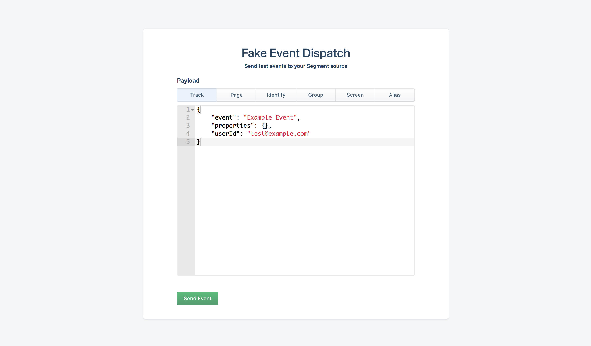
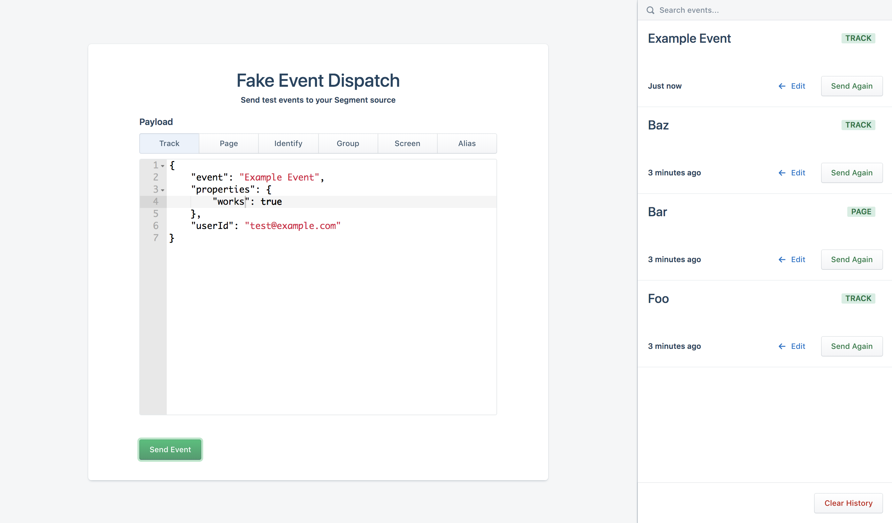

# Segment Fullstack Take Home

We have an example internal app built with [React](https://reactjs.org/tutorial/tutorial.html), [Evergreen](https://evergreen.segment.com/), Next, and [TypeScript](https://www.typescriptlang.org/docs/home.html). This fake tool is designed to help users easily send test events to Segment.



We'd like to extend this app with a new history feature. Requirements are the following:

1. Users should be able view the list of previously sent events (they do not need to persist on refresh)
2. Each entry should include details such as type, name, and some indicator of when it was sent
3. Within each entry, clicking "Edit" should copy the previously-sent payload into the text editor
4. Within each entry, clicking "Send Again" should re-send the event
5. Users should be able to filter the list of events by name
6. Clicking "Clear History" should remove all events from this list
7. We should display a zero state when no events have been sent

Example implementing the above requirements:



Note: the app doesn't actually send events to Segment under the hood. This behavior is faked/mocked, and not expected to be implemented for the purpose of this exercise.

## Get started

```
# Install yarn: https://yarnpkg.com/en/docs/install
$ yarn
$ yarn dev
```

To run the linter, `yarn lint`
